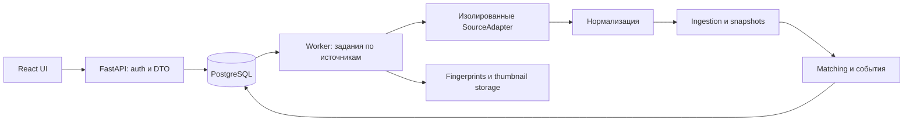

# Архитектура

Статус: решение Phase 0, 2026-09-06. Это контракт для последующей реализации.

## Основной подход

Модульный монолит для максимум примерно десяти пользователей. Python 3.12+, FastAPI, Pydantic, SQLAlchemy 2, Alembic, httpx, PostgreSQL; React/TypeScript/Vite. Отдельные API и worker процессы используют общие модули и одну БД. PostgreSQL хранит задания; Redis, Celery и микросервисы не требуются.

Версии зависимостей и образы закрепляются при реализации после проверки совместимости. Не предполагаем, что любая текущая версия автоматически совместима со всем стеком.



## Структура проекта

Планируемая структура; модули и файлы приложения создаются в Phase 1, без пустых реализаций, создающих видимость работающего сервиса.

```text
backend/
  pyproject.toml
  Dockerfile
  alembic.ini
  migrations/versions/
  app/
    main.py
    config.py
    api/                 # auth, searches, vehicles, duplicates, events, health
    domain/              # нормализованные DTO, enum, правила
    db/                  # SQLAlchemy, repositories, unit of work
    services/            # ingestion, search, snapshots, events, user state
    sources/
      base.py
      registry.py
      mock/              # adapter, parser, models, normalization
      avito/             # adapter, transport, parser, models, normalization
      auto_ru/
      drom/
    matching/            # candidates, signals, scorer, decisions, clustering
    images/              # secure fetch, fingerprints, storage
    descriptions/        # rule analyzer, интерфейс будущего analyzer
    auth/                # password hash, sessions, bootstrap
    worker/              # queue runner, scheduler, source budgets
  tests/
    unit/
    integration/
    fixtures/{mock,avito,auto_ru,drom}/
frontend/
  src/{app,features,components,api,styles}/
  package.json
  Dockerfile
docs/
docker-compose.yml
.env.example
.gitignore
README.md
```

Ядро принимает только доменные DTO. CSS, URL-параметры, transport payload и отображение справочников принадлежат source adapter. `source_metadata` доступен для диагностики адаптера и не используется matching, фильтрами или UI напрямую.

## Поиск и фоновые операции

1. API валидирует фильтры, права, лимит пользовательских поисков и cooldown. Создаёт `SearchRun` и отдельное задание на каждый включённый источник. Ответ `202` содержит run ID и URL статуса.
2. Один worker исполняет задания независимо. Ограничители общие для всего источника, включая поиск, detail и картинки. Сетевых операций внутри длинных DB-транзакций нет.
3. Адаптер строит эквивалентный запрос в пределах capabilities. Получает не больше заданных страниц/объявлений. Результат содержит completeness и отчёт о применённых фильтрах.
4. Нормализация и локальные фильтры отделяют подтверждённые совпадения от непроверяемых. Ingestion идемпотентно обновляет объявление и его связь с поиском.
5. Matching выполняется среди автомобилей, доступных этому пользователю. Персональный кластер и его состав пересчитываются с учётом ручных решений.
6. API отдаёт готовые результаты по мере завершения источников. Клиент опрашивает run с ограниченной частотой; websocket на MVP не нужен.

Разовый `/api/search` использует тот же путь: временный SavedSearch с `is_temporary=true`, без расписания и с configurable TTL. Сохранение переводит его в постоянный. Удаление временного поиска убирает его связи; данные, используемые другими поисками/избранным/историей, не удаляются каскадно.

Ограниченная выдача всегда помечается: «Проверены первые N страниц; результаты могут быть неполными». Сортировка и количество относятся к собранному набору, а не всей базе площадки.

## Контракт адаптера

```text
CarSourceAdapter[RawListing]
  capabilities() -> SourceCapabilities
  search(filters: UnifiedSearchFilters, page: PageRequest) -> SourcePage[RawListing]
  get_listing(ref: SourceListingRef) -> SourceListingResult[RawListing]
  normalize(raw: RawListing, observed_at: UTC datetime) -> NormalizedListing
  health_check() -> SourceHealthResult
```

Все I/O методы async. `SourceListingRef` — source + проверенные ID/URL, не произвольный URL пользователя. Нормализация детерминирована и не обращается к сети. `PageRequest` содержит внутренний номер страницы/opaque cursor, который проверяет и переводит адаптер.

`SourcePage`: items, next_page, fetched_at, parser_version, `coverage=complete|limited|unknown`, `outcome=OK|PARTIAL|ERROR`, filter_report, warnings, error. Здесь complete означает завершение запрошенного обхода, а не доказанную полноту всей площадки.

`SourceCapabilities`: для каждого фильтра `native|local|unsupported|unverified`, поддержка detail, фото, статусов, пагинации и сортировки, ограничения страниц/результатов, версия mapping. Возможности зависят от способа доступа и аккаунта. У непроверенного live adapter всё `unverified`, а не оптимистичное `native`.

`SourceError`: code, safe_message, retryable, retry_after, diagnostic_id. Коды: `SOURCE_UNAVAILABLE`, `RATE_LIMITED`, `AUTH_REQUIRED`, `ACCESS_NOT_CONFIGURED`, `ACCESS_NOT_PERMITTED`, `PARSER_ERROR`, `UNSUPPORTED_FILTER`. API возвращает независимые состояния источников; сбой одного не превращается в HTTP 500 общего результата. Неожиданная ошибка также логируется с trace ID и изолируется.

Для detail результат различает ACTIVE, подтверждённое REMOVED, UNKNOWN и транспортную ошибку. Parser должен доказать, что видит карточку/явное сообщение о снятии, а не CAPTCHA или произвольную страницу 404.

## Worker и нагрузка

В MVP один процесс worker; API никогда самостоятельно не ходит к площадкам. Worker выбирает готовые jobs через короткую транзакцию `FOR UPDATE SKIP LOCKED`, выставляет lease и освобождает DB lock до I/O. Heartbeat продлевает lease; каждый claim получает fencing token. После утраты lease устаревший исполнитель не может записать итог задания.

Unique active job на поиск/источник предотвращает совпадение ручного и планового refresh. Scheduler хранит next_due_at в БД: интервал по умолчанию 25 минут плюс jitter ±2 минуты. Ручной refresh: cooldown 5 минут на поиск и общий source budget, атомарная проверка сервером. Это собственные начальные ограничения проекта, а не заявленные лимиты сайтов.

Начальные бюджеты: не более 3 страниц и 100 объявлений на источник/run; один одновременный запрос на источник; минимум 5 секунд между началами запросов; максимум 20 detail-запросов за run; максимум 6 фото на новое/изменившееся объявление. Фото обрабатываются отдельной ограниченной очередью и могут догружать matching позже. Бюджет нельзя обходить созданием множества поисков.

HTTP timeout: connect 5 с, общий запрос 20 с; deadline задания 180 с. Не более двух повторов только для временных сетевых/5xx ошибок с backoff+jitter. `429` сохраняет Retry-After как source-wide not_before и освобождает worker до следующей попытки; отсутствие Retry-After — configurable пауза 30 минут. CAPTCHA/401/403/parser drift останавливают источник без циклических повторов. Состояние сохраняется после рестарта. Возврат после parser/access ошибки — после исправления конфигурации или явного контролируемого health probe. Health endpoint сам сетевые запросы не запускает.

## Состояние объявления и история

Отсутствие в первых страницах — только «не замечено в этой выдаче». Listing остаётся в последнем подтверждённом состоянии с видимой давностью. На проверку карточки выделяется ограниченный бюджет. REMOVED подтверждается распознанной карточкой снятого объявления либо двумя независимыми валидными not-found ответами detail с интервалом не менее 24 часов. Ответы антибота/транспортные ошибки не считаются такими ответами.

UNKNOWN применяется при отсутствии достоверного состояния, а не вместо сохранённого ACTIVE на каждом timeout. RELISTED относится к старому снятому объявлению, связанному с новым; это персональное отображение через relist_links, глобальное состояние старого Listing остаётся REMOVED. Новое получает ACTIVE. Нельзя уверенно назвать relist только потому, что старое не встретилось в выдаче.

Snapshot создаётся при первом наблюдении и изменении значимых полей, last_seen обновляется без snapshot. Событие и snapshot сохраняются атомарно. Первая загрузка поиска создаёт NEW_LISTING по его новым связям, последующие одинаковые ответы ничего не дублируют. Цена сравнивается внутри одного source listing и валюты; смена минимальной цены кластера из-за состава не является PRICE_DROP.

## Персональность и безопасность

Нормализованные публичные Listing можно повторно использовать между поисками. Кластеры и решения matching принадлежат пользователю: отдельная таблица membership позволяет двум людям по-разному объединять общие Listing. Права на карточку требуют её связи с собственным поиском или сохранённым состоянием; наличие UUID не даёт доступ. Лента кластера включает только объявления, наблюдённые для этого пользователя. Никакого автоматического добавления чужих находок или заметок.

Закрытые local accounts; Argon2id; случайная серверная session, в БД только digest токена; HttpOnly, SameSite=Lax, Secure при HTTPS, ротация при входе, ограниченный срок, logout revocation. Мутации проверяют CSRF token и Origin. Bootstrap admin через CLI с интерактивным вводом пароля, новые пользователи только admin. Rate limit входа. Для локального HTTP cookie Secure выключается явно только в local profile. Не сохранять пароль или bearer token в localStorage.

Фото: HTTPS, точный allowlist хостов из проверенного adapter, никакого wildcard на произвольные домены; проверка DNS/IP и каждого redirect, запрет loopback/private/link-local/metadata IPv4/IPv6, привязка соединения к проверенному адресу против DNS rebinding. Максимум 5 MiB входа и 20 MP декодирования, MIME плюс проверка декодером, timeout, без SVG. Временные файлы удаляются после fingerprints. Thumbnail cache выключен по умолчанию до подтверждения условий источника, при включении одна картинка до 768 px через Storage interface. Отсутствие фото не ломает карточку.

Описание — обычный текст React, без стороннего HTML. Телефоны, email и лишние контакты вычищаются при ingestion/подготовке fixtures; source_metadata ограничен allowlist и размером. `seller_name` по умолчанию не сохраняется. Секреты только environment, безопасные ошибки/logs не содержат cookies, payload с контактами или авторизационные URL.

## API и отображение

| Группа | Контракт |
| --- | --- |
| `/api/auth/login`, `/logout`, `/me` | Сессии; общая ошибка неверных credentials |
| `POST /api/search`, `GET /api/search-runs/{id}` | Создать разовый поиск, получить прогресс и source outcomes |
| `/api/searches`, `/api/searches/{id}` | CRUD собственных поисков, версия фильтров |
| `POST /api/searches/{id}/refresh` | 202 job/run; 429 + Retry-After при cooldown |
| `/api/vehicles`, `/api/vehicles/{id}` | Собственные кластеры, пагинация и доступные source listings |
| `/api/vehicles/{id}/favourite`, `/hide`, `/note` | Идемпотентные PUT, DELETE для снятия состояния |
| `/api/duplicates`, `/{id}/merge`, `/{id}/reject` | Review, причины, решение пользователя |
| `/api/vehicles/{id}/split` | Выбранные listing IDs и ожидаемая версия кластера |
| `/api/events` | Собственные события; отдельный read_at |
| `/api/health`, `/api/ready`, `/api/sources/health` | Liveness, DB/migration readiness, cached source status |

DTO результатов включает sources, partial, checked_at, freshness, filter_report, pagination. Cursor по sort key + ID, limit по умолчанию 30, максимум 100; сортировки явно перечислены. Конфликт версии merge/split → 409; чужой ресурс → 404. Закрытые endpoints требуют auth, кроме минимального liveness/readiness без секретов.

Цена карточки — min/max известных ACTIVE объявлений в одной валюте, UNKNOWN/REMOVED показываются отдельно с давностью. При конфликте характеристик отображаем значение с указанием источника; исходные данные не переписываем ради красивой единой карточки. Описание и история доступны отдельно по каждому источнику. Вместо «точность 94%» — «сходство 94/100» и причины: score не является статистически откалиброванной вероятностью.

## Проверяемость

Structured logs: request_id, run_id, source, saved_search_id, request_type, duration_ms, result_count, status, parser_version. SourceHealth — последнее наблюдение и heartbeat worker, не зелёная заглушка. Parser проверяет schema/page identity и явный empty marker; ноль распознанных элементов без признаков пустой выдачи — PARSER_ERROR.

Offline fixture-тесты не обращаются к сайтам. Интеграционные тесты используют PostgreSQL, а не SQLite, поскольку важны JSONB, locking и unique indexes. Детали схемы — [database.md](database.md), модели — [models.md](models.md), matching — [deduplication.md](deduplication.md), факты исследования — [sources.md](sources.md).
