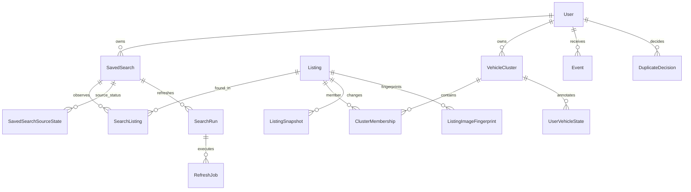

# База данных

Статус: логическая схема Phase 0, PostgreSQL. Физические миграции создаются и проверяются в Phase 1/2. Используем реляционные поля для бизнес-данных, JSONB — только для версионированных фильтров, объяснений и небольших расширений.

## Владение данными

`Listing(source, source_listing_id)` уникален глобально, чтобы повторный поиск не дублировал наблюдения. `VehicleCluster` принадлежит пользователю; его состав хранится в `ClusterMembership`, а не в глобальном `Listing.cluster_id`. Это осознанное уточнение схемы спецификации: ручной split одного пользователя не должен менять результаты другого.

Пользователь видит Listing только через собственную связь с поиском/кластером. Автоматическая кластеризация рассматривает только уже доступные ему объявления. Общая запись объявления не даёт права увидеть чужой поиск, историю персональных событий, заметку или решение о дубле.

## Таблицы

PK — UUID, кроме явно указанных составных ключей. Время — TIMESTAMPTZ UTC, деньги — NUMERIC(14,2), объём — NUMERIC(6,3), версии — int. NOT NULL для ключей, владельцев, версий, enum/default и времён создания; неизвестные характеристики nullable. Enum хранить как TEXT + CHECK, чтобы миграции новых значений были явными.

| Таблица | Поля и ограничения |
| --- | --- |
| users | id, username, email nullable, password_hash, role=user/admin, enabled, created_at; UNIQUE(lower(username)), UNIQUE(lower(email)) WHERE email IS NOT NULL |
| sessions | id, user_id FK, token_digest UNIQUE, csrf_digest, created_at, expires_at, revoked_at; токен в открытом виде не хранится |
| saved_searches | id, user_id FK, name, filters JSONB, filters_version, enabled, enabled_sources, refresh_interval_seconds, created_at, last_checked_at, last_completed_at, next_due_at, last_manual_refresh_at, is_temporary, expires_at; CHECK interval ≥ 1200 |
| saved_search_source_states | PK(search_id, source), status, last_attempt_at, last_success_at, last_error_code/message, last_result_count, last_run_id, retry_after |
| search_runs | id, search_id, user_id, filters_version, requested_at, completed_at, trigger=manual/scheduled, outcome=pending/running/complete/partial/failed; копия фильтров запуска JSONB |
| refresh_jobs | id, run_id, search_id, source, state, attempt, not_before, lease_until, lease_token, started_at, completed_at, error_code; UNIQUE(run_id, source); только одно queued/running задание на (search_id, source) |
| source_health | source PK, status, last_attempt_at, last_success_at, error_code/message, parser_version, not_before, circuit_state; хранит общий cooldown |
| worker_heartbeats | worker_id PK, last_seen_at; readiness отделён от состояния источников |
| listings | id, source, source_listing_id, source_url, поля NormalizedListing, first_seen_at, last_seen_at, last_detail_checked_at, version, field_observed_at JSONB; UNIQUE(source, source_listing_id) |
| search_listings | PK(search_id, listing_id), user_id, first_seen_at, last_seen_at, last_run_id, filters_version, match_state=confirmed/unverified/not_matching; составной FK(search_id,user_id) |
| vehicle_clusters | id, user_id, representative_listing_id nullable, version, created_at, first_seen_at, last_seen_at, archived_at; UNIQUE(id,user_id) |
| cluster_memberships | user_id, cluster_id, listing_id, attached_at, reason, score_id nullable; PK(user_id,listing_id), FK(cluster_id,user_id) → vehicle_clusters; у пользователя объявление только в одном кластере |
| listing_snapshots | id, listing_id, listing_version, observed_at, price, currency, mileage_km, status, description_hash, description_text_on_change nullable, main_image_fingerprint nullable; UNIQUE(listing_id,listing_version) |
| listing_image_fingerprints | id, listing_id, image_url, position, algorithm, algorithm_version, content_digest, fingerprint BYTEA, created_at, quality_flags; UNIQUE(listing_id,content_digest,algorithm,algorithm_version) |
| duplicate_candidates | id, user_id, listing_a_id, listing_b_id, score JSONB, algorithm_version, config_version, evaluated_versions, updated_at, state=pending/merged/rejected/stale; CHECK a < b; UNIQUE(user_id,a,b) |
| duplicate_decisions | id, user_id, a, b, decision=same/different, active, reason, created_at, supersedes_id; CHECK a < b; один active на(user_id,a,b), история неизменна |
| cluster_operations | id, user_id, operation=auto_merge/manual_merge/split, created_at, before_memberships JSONB, after_memberships JSONB, evidence_ref, actor; аудит состава и отката |
| user_vehicle_states | user_id, cluster_id, favourite bool, hidden bool, note text, version, updated_at; PK(user_id,cluster_id), составной FK(cluster_id,user_id) |
| events | id, user_id, search_id nullable, listing_id nullable, cluster_id_at_event nullable, snapshot_id nullable, type, event_key, payload JSONB, occurred_at, read_at; UNIQUE(user_id,event_key) |
| relist_links | id, user_id, old_listing_id, new_listing_id, confidence, evidence_ref, confirmed_by nullable, created_at; UNIQUE(user_id,old_listing_id,new_listing_id), CHECK old != new |

Дополнительно `listing_descriptions` можно выделить в Phase 1 вместо description_text_on_change, если это упростит чтение истории; полное описание хранится только при его изменении. `field_observed_at` содержит лишь время известных нормализованных полей и не является source_metadata.

Составные FK/user_id применяются также к jobs/runs/search listings и операциям, где возможна подмена владельца. Проверка доступа выполняется в repository/service, DB constraints служат дополнительной защитой. Создание membership требует уже существующей пользовательской связи наблюдения, проверяемой в той же транзакции.

## Индексы

- UNIQUE listings(source, source_listing_id) — ingestion identity.
- listings(make, model, year, mileage_km) и listings(make, model, generation, year); отдельный индекс cluster_memberships(user_id, cluster_id, listing_id). Candidate query начинает с user scope и ограничивает выборку.
- Индексы на FK: search_listings(listing_id), cluster_memberships(listing_id), fingerprints(listing_id), events(listing_id), snapshots(listing_id, observed_at DESC).
- saved_searches(next_due_at, id) WHERE enabled AND NOT is_temporary.
- refresh_jobs(not_before, id) WHERE state='queued'; refresh_jobs(lease_until) WHERE state='running'; partial UNIQUE(search_id,source) WHERE state IN ('queued','running').
- events(user_id, occurred_at DESC, id DESC); events(user_id, occurred_at DESC) WHERE read_at IS NULL.
- duplicate_candidates(user_id,state,updated_at); active decisions UNIQUE(user_id,a,b) WHERE active.
- user_vehicle_states(user_id,cluster_id) WHERE favourite; аналогично hidden; sessions(expires_at).

GIN на весь source_metadata не нужен. Индексы для сортировки кластеров добавляются после EXPLAIN на реалистичном наборе, без преждевременной materialized view. Candidate limit 100 задаётся config; выход за лимит явно отмечается как неполная оценка.

## Транзакционные правила

### Ingestion

Сетевой ответ нормализуется до транзакции. Upsert по unique identity, row lock существующего Listing, сравнение observed_at/field_presence. Старый или повторный ответ не откатывает данные. Изменение значимых полей увеличивает version; first_seen_at сохраняется, last_seen_at монотонно растёт.

В одной транзакции: listing update, snapshot, связи поиска и пользовательские события. `listing_version` отличает реальные переходы A→B→A: нельзя дедуплицировать snapshots одним content hash навсегда. Для нескольких поисков пользователя NEW_LISTING относится к первой связи с каждым поиском (`event_key=new:search_id:listing_id`); price/status события относятся к snapshot (`event_key=type:snapshot_id`) и создаются для имеющих доступ пользователей без повторов. Новый пользователь не получает чужую старую историю уведомлений.

RefreshJob завершается только с актуальным lease_token. Прогресс по уже сохранённым объявлениям может пережить сбой задания; повторный прогон безопасен. Ошибки одного нормализованного элемента делают outcome PARTIAL, не откатывают остальные; сохраняется счётчик rejected items. UNKNOWN поля не стирают прежние факты.

### Matching и ручные операции

На короткое изменение кластеров — transaction advisory lock по user_id, затем row locks cluster IDs в стабильном порядке и проверка version. При десяти пользователях это проще сложной распределённой кластеризации. Фото/score готовятся до lock; перед записью проверяются listing versions и актуальные decisions.

Операция атомарно меняет memberships, audit, candidates, user state и пользовательское событие при необходимости. Manual different проверяется между всеми членами объединяемых кластеров, а не только сравниваемой парой. Транзитивный merge не может обойти reject. Политика merge/split состояний описана в [deduplication.md](deduplication.md).

## Удаление, сроки хранения, миграции

Удаление saved search каскадно удаляет source states/jobs/search links, но не глобальный Listing, snapshots или другие поиски. Временные поиски по умолчанию живут 7 дней. Неиспользуемые listing/thumbnail чистятся после configurable retention 180 дней, только если нет поисков, пользовательского состояния, manual decisions, memberships или событий, требующих сохранения. Очистка старых пустых memberships — отдельная контролируемая операция, история не теряется молча.

Удаление пользователя удаляет его сессии/поиски/кластеры/заметки/решения/события, сохраняя общие Listing других пользователей. Резервная копия PostgreSQL включает историю; storage thumbnails восстанавливаем либо пересоздаём при допустимом доступе.

Миграции Alembic явные и проверяемые. Compose запускает единственный migrate job до API/worker; приложение не делает create_all на старте. Проверки: upgrade на пустой БД, повторный upgrade без изменений, schema/model consistency, FK/unique/check нарушения и конкурентный ingestion. Downgrade проверяется только там, где он поддержан без потери пользовательских данных; разрушительное откатывание не маскируется под безопасный запуск.
